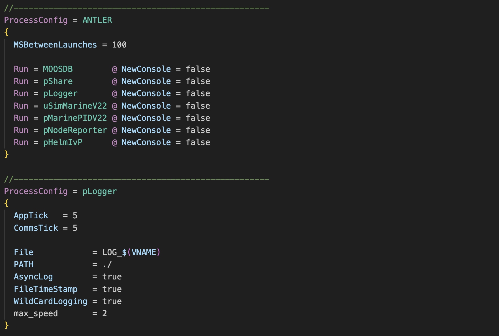
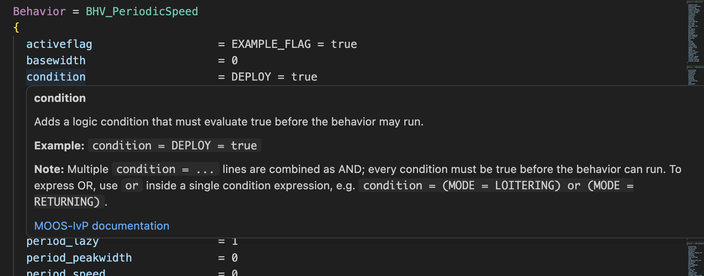
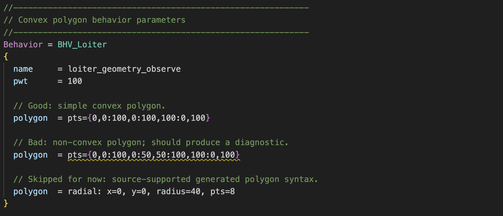

# MOOS-IvP Editor for VS Code

[](https://github.com/moos-ivp/vscode-moos-ivp-editor/actions/workflows/ci-cd.yml)

The MOOS-IvP Editor extension for Visual Studio Code adds syntax highlighting,
hover descriptions, semantic highlighting, and conservative diagnostics for
MOOS mission files, IvP behavior files, and MOOS-IvP patch files.

It supports `.moos`, `.xmoos`, `.bhv`, and `.xbhv` files. The `.xmoos` and
`.xbhv` modes cover patch inputs commonly used with `nspatch`; `plug_*.moos`
and `meta_*.moos`/`meta_*.bhv` files are handled by their normal `.moos` and
`.bhv` extensions.

## Features

### Syntax Highlighting

Baseline TextMate grammars highlight MOOS and IvP behavior file structure:
comments, block headers, assignments, braces, directives, and common language
forms.

Semantic highlighting adds MOOS-IvP-aware classification for known apps,
behaviors, and parameters. Parameter highlighting is block-aware, so a
parameter is only classified as known when it belongs to the current
`ProcessConfig` or `Behavior` block.



### Hover Descriptions

Hover text is available for known apps, behaviors, and parameters. Parameter
hovers are block-aware, so shared names such as `condition` or `radius` use
the description for the current `ProcessConfig` or `Behavior` block.

A parameter hover is structured as:

- parameter name
- concise description
- example line, when available
- default value, when known from documentation or source
- source reference or MOOS-IvP documentation link, when available

Descriptions are bundled with the extension and are derived from MIT MOOS-IvP
documentation, local MOOS-IvP source, and reviewed manual overrides.



### Diagnostics

Diagnostics warn on selected source-backed configuration mistakes. Current
coverage includes:

- known parameters used in the wrong `ProcessConfig` or `Behavior` block
- simple type checks for booleans, numbers, non-negative numbers, and enums
- simple range checks where the MOOS-IvP source gives a clear bound
- convex polygon checks for supported `pts={...}` values
- waypoint path syntax checks for supported point-list values
- contact filter region checks for supported polygon region values

Diagnostics intentionally skip cases where the extension would have to guess.
Skipped areas include full MOOS expression evaluation, runtime variable
existence, generated polygon forms such as `radial: ...`, geometry aliases, and
complex app-specific semantics that are not modeled from source evidence.



## Requirements

- Visual Studio Code `1.32` or later.
- No runtime MOOS-IvP install is required.
- Contributors expanding coverage should have Node.js and a local MOOS-IvP
  checkout.

## Install

Install from VS Code:

1. Open the Extensions view with `Cmd+Shift+X` on macOS or `Ctrl+Shift+X` on
   Windows/Linux.
2. Search for `MOOS-IvP Editor`.
3. Install the extension and reload VS Code if prompted.

Install from a local VSIX:

```sh
npx @vscode/vsce package
code --install-extension moos-ivp-editor-1.0.0.vsix
```

Reload VS Code after installing or replacing the extension.

## Development

See [COVERAGE_GUIDE.md](COVERAGE_GUIDE.md) for adding apps, parameters, hover
descriptions, and diagnostics.

## Links

- [MOOS-IvP homepage](https://oceanai.mit.edu/moos-ivp)
- [pAntler documentation](https://oceanai.mit.edu/ivpman/pmwiki/pmwiki.php?n=IvPTools.PAntler)
